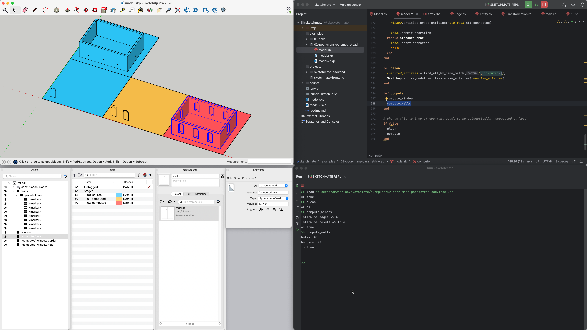

# Example: Poor man's parametric CAD

The idea here is to treat SketchUp as a code-driven parametric CAD.

`./launch-sketchup.sh /absolute/path/to/examples/02-poor-mans-parametric-cad/model.skp`

We want to model a simple house walls with window holes and borders. See the red geometry on this screenshot:

Instead of modelling it via UI, we instead prepare only source data via UI and write some code to generate the rest.

Blue areas are source data. We prepared:
 
1) Walls with markers for windows
2) Geometry for window shape and a profile for window border

Computation of final geometry is done in two stages:

1) First, based on window shape we produce geometry for window hole and 
use follow me tool to extrude border with given profile (yellow on the screenshot), see [compute_window in model.rb](model.rb).
2) Second, based on previous geometry we take a copy walls template and punch window holes in it. And finally we attach
window borders on top (red on the screenshot), see [compute_walls in model.rb](model.rb).

The code is written in a style that it can be easily reloaded from REPL and geometry recomputed with modified source
data.