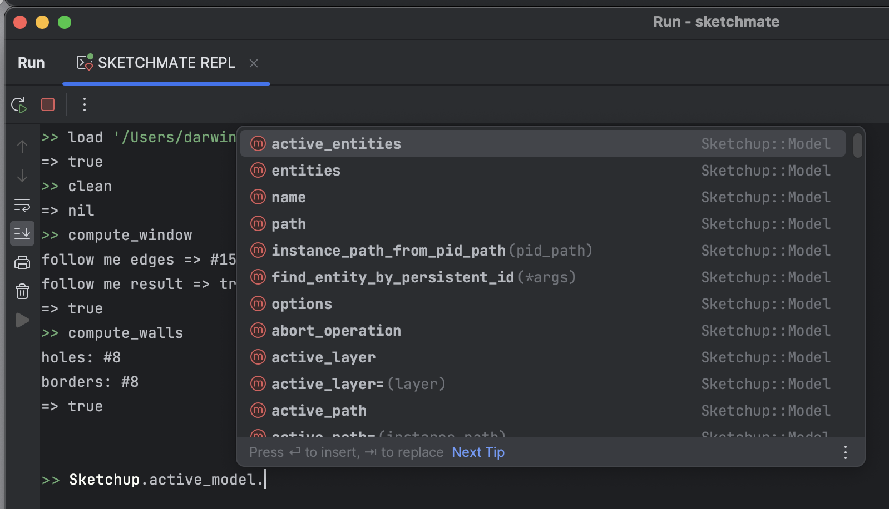
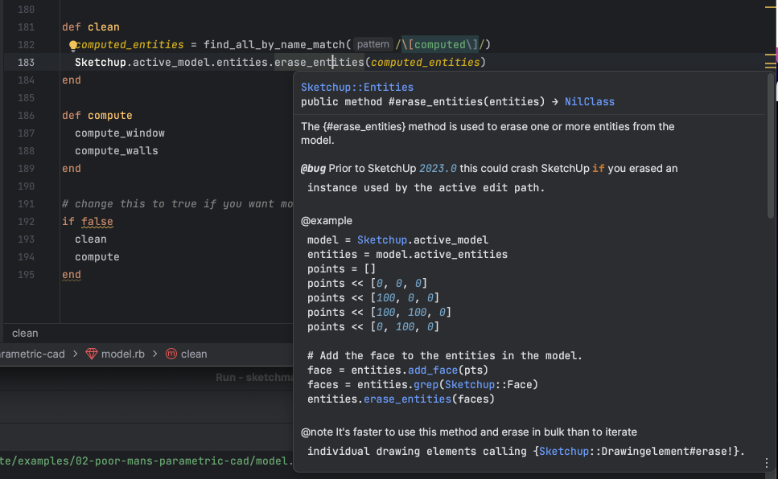
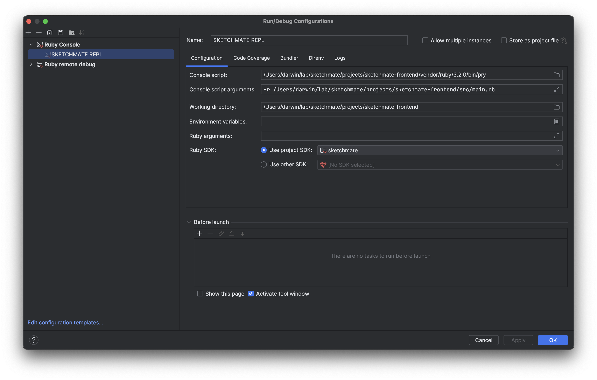

# SketchMate - a REPL companion for your SketchUp

> Cast new coding spells to your SketchUp projects!

## Overview

SketchMate integrates SketchUp with RubyMine. The main goal is to provide plumbing for good REPL experience.




## Installation

I'm sorry this is currently only tested on macOS with SketchUp 2023 (Pro).

We don't use SketchUp's extension mechanism (yet). Instead a [launcher script](./launch-sketchup.sh) should be used
to boot SketchUp with SketchMate.

SketchMate consists of two projects:
1) Backend code which is a server running inside SketchUp and listening for remote REPL commands.
2) Frontend code which is a [Pry console](https://github.com/pry/pry) modified to send REPL commands to the backend for evaluation.

Pry is a Ruby library with additional dependencies. We download these dependencies using [bundler](https://bundler.io/). 
They are stored locally under vendor directories. Assuming your system Ruby is in good shape, you can download deps the usual way:

```bash
cd projects/sketchmate-backend
bundle install
# this should populate projects/sketchmate-backend/vendor
```

```bash
cd projects/sketchmate-frontend
bundle install
# this should populate projects/sketchmate-frontend/vendor
```

### Starting a modelling session

Use the provided [launcher script](./launch-sketchup.sh) and pass absolute path to your model.

```bash
./launch-sketchup.sh /absolute/path/to/examples/01-hello/model.skp
```

For convenience SketchMate will try to load file with the same name as the model as Ruby init script
(in this case `/absolute/path/to/examples/01-hello/model.rb`).

### RubyMine configuration

RubyMine has nice build-in support for Ruby REPL and is Pry-aware. This is what allowed me to configure SketchMate REPL console:



Note the `Console script arguments` - this is how is our frontend code actually injected into Pry Console.

### SketchMate configuration

You can configure some aspects of it via environmental variables prior to launching the launcher script

```bash
export SKETCHMATE_VERBOSE=1
export SKETCHMATE_RDEBUG="ide port=7000"
export SKETCHMATE_PORT="4433"
```

See the code for more.

### Gotchas

#### Ruby versions

Please note that latest SketchUp 2023 is currently bundling Ruby 2.7.7. Your system Ruby might be running 3.2.0 or newer.
This could potentially cause incompatibilities because backend does not run in exactly the same environment as the frontend.
It is possible to use rbenv or similar isolation techniques to downgrade Ruby to match SketchUp.

#### RubyMine does not highlight `Tools -> Load File/Selection into IRB/Rails Console`

RubyMine has some assumptions about locations of your Ruby files. You must configure your project in way that scripts
you are using with your SketchUp model via REPL take part in RubyMine project - they must be part of project's content root.
